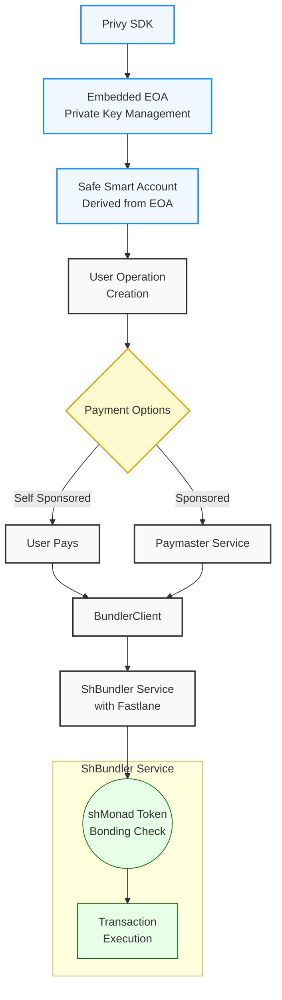
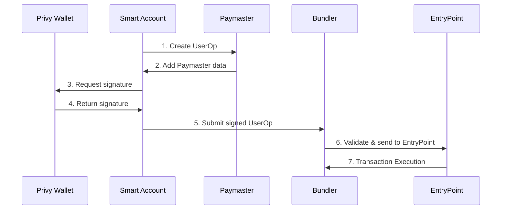
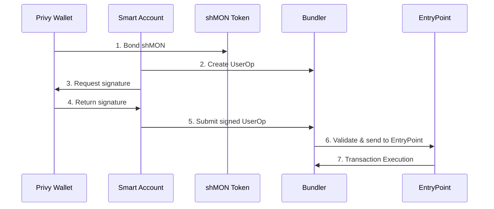

# Privy+Safe+Fastlane: Complete Account Abstraction Stack

## A Technical Demo of ERC-4337 Implementation with Custom Paymaster Integration

<p align="center">
  
</p>

This project demonstrates a complete Account Abstraction (AA) stack integration combining Privy's embedded wallet solution with Safe smart accounts and Fastlane's bundler infrastructure. It showcases the full technical flow from EOA wallet creation through smart contract account deployment, transaction creation, paymaster interaction, and transaction execution - all following ERC-4337 standards.

## System Architecture

The integration combines Privy's embedded wallet (EOA) with Safe Smart Accounts, Fastlane's bundler service, and a custom paymaster for transaction sponsorship.



## Core Technical Components

| Component | Implementation | Version | Role |
|-----------|----------------|---------|------|
| Wallet | Privy SDK | latest | EOA creation and signing |
| Smart Account | Safe | 1.4.1 | ERC-4337 compatible AA wallet |
| AA Library | permissionless.js | latest | Account abstraction SDK |
| Bundler | ShBundler | custom | UserOperation processing |
| Token | shMON | N/A | Bonding for self-sponsorship |
| EntryPoint | ERC-4337 | 0.7.0 | Account Abstraction protocol |
| Chain | Monad | testnet | High throughput L1 with 4337 support |
| Paymaster | Custom | N/A | Gas sponsorship service |

## Common Implementation Components

### 1. Authentication & Wallet Layer

Privy provides a seamless way to create an embedded wallet without requiring users to manage seed phrases:

```typescript
// Privy authentication and wallet creation
const { embeddedWallet } = useWallets();
const provider = await embeddedWallet.getEthereumProvider();

// Create wallet client from provider
const walletClient = createWalletClient({
  account: EOA,
  chain: MONAD_CHAIN,
  transport: custom(provider as EIP1193Provider)
});
```

### 2. Smart Account Creation

The demo uses Safe's 4337 counterfactual implementation through permissionless.js:

```typescript
// Creating a Safe smart account
const safeSmartAccount = await toSafeSmartAccount({
  client: publicClient,
  entryPoint: {
    address: entryPoint07Address as Address,
    version: "0.7",
  },
  owners: [walletClient], // Privy wallet client as the owner
  version: "1.4.1" // Safe account version
});

// Smart Account client for simplified transactions
const smartAccountClient = createSmartAccountClient({
  account: safeSmartAccount,
  chain: MONAD_CHAIN,
  bundlerTransport: http(bundlerUrl),
  userOperation: {
    estimateFeesPerGas: async () => {
      const gasPrice = await bundlerClient.getUserOperationGasPrice();
      return gasPrice.fast;
    },
  }
});
```

## 1. Paymaster Sponsored Flow

In this flow, transactions are sponsored by a paymaster service, allowing users to execute transactions without paying for gas.



### Paymaster Integration Flow

1. **Authentication**: Users authenticate with Privy to create or access their embedded wallet
2. **Smart Account Creation**: The embedded wallet is used to create a Safe smart account
3. **UserOperation Creation**: When sending a transaction, a custom UserOperation is created
4. **Paymaster Integration**: The Sponsor EOA (paymaster) adds sponsorship data to the UserOperation and signs it
5. **UserOperation Signing**: After the paymaster has signed, the embedded wallet signs the complete UserOperation
6. **Transaction Submission**: The fully signed UserOperation is sent to the fastlane bundler
7. **Transaction Confirmation**: The receipt is retrieved and status is updated

This sequence is important because:
- The paymaster must commit to sponsoring the transaction before the user signs
- The user's signature needs to cover the complete UserOperation (including paymaster data)
- This ensures proper validation at the bundler and entry point level

### Sponsored Transaction Implementation

```typescript
// Function to send a sponsored transaction
async function sendSponsoredTransaction(recipient: Address, amount: bigint) {
  try {
    // 1. Get gas prices from the bundler
    const gasPrice = await bundlerWithPaymaster.getUserOperationGasPrice();
    logger.gasPrice('Gas prices received', gasPrice);
    
    // 2. Prepare the user operation with the paymaster
    const userOperation = await bundlerWithPaymaster.prepareUserOperation({
      account: smartAccount,
      calls: [
        {
          to: targetAddress,
          value: amountWei,
          data: '0x' as Hex,
        },
      ],
      maxFeePerGas: gasPrice.standard.maxFeePerGas,
      maxPriorityFeePerGas: gasPrice.standard.maxPriorityFeePerGas,
      paymasterVerificationGasLimit,
      paymasterPostOpGasLimit,
    });
    
    logger.userOp('User operation prepared', userOperation);
    
    // 3. Explicitly sign the user operation with EOA via Privy
    const signature = await smartAccount.signUserOperation(userOperation);
    userOperation.signature = signature;
    
    // 4. Submit the signed user operation to the bundler
    const userOpHash = await bundlerWithPaymaster.sendUserOperation(userOperation as UserOperation);
    
    logger.info('Transaction submitted with hash', userOpHash);
    
    // 5. Wait for transaction confirmation
    const receipt = await bundlerWithPaymaster.waitForUserOperationReceipt({ hash: userOpHash });
    
    return {
      userOpHash,
      transactionHash: receipt.receipt.transactionHash
    };
  } catch (error) {
    logger.error('Transaction failed', error);
    return null;
  }
}
```

### Custom Paymaster Client Implementation

The demo includes a custom paymaster client that interfaces with the backend paymaster API:

```typescript
// Create a paymaster client for gas sponsorship
const paymasterClient = {
  getPaymasterAndData: async (userOperation) => {
    try {
      // First get stub data for gas estimation
      const stubResponse = await fetch('/api/paymaster', {
        method: 'POST',
        headers: { 'Content-Type': 'application/json' },
        body: JSON.stringify({
          jsonrpc: '2.0',
          id: 1,
          method: 'pm_getPaymasterStubData',
          params: [userOperation, ENTRY_POINT_ADDRESS, CHAIN_ID]
        })
      });
      
      const stubData = await stubResponse.json();
      if (stubData.error) {
        throw new Error(`Paymaster stub error: ${stubData.error.message}`);
      }
      
      // After gas estimation, get the real paymaster data with signature
      const response = await fetch('/api/paymaster', {
        method: 'POST',
        headers: { 'Content-Type': 'application/json' },
        body: JSON.stringify({
          jsonrpc: '2.0',
          id: 2,
          method: 'pm_getPaymasterData',
          params: [userOperation, ENTRY_POINT_ADDRESS, CHAIN_ID]
        })
      });
      
      const data = await response.json();
      if (data.error) {
        throw new Error(`Paymaster error: ${data.error.message}`);
      }
      
      return data.result;
    } catch (error) {
      console.error('Error getting paymaster data:', error);
      throw error;
    }
  }
};
```

## 2. Self-Sponsored Flow

In this flow, users pay for their own gas fees through a bonding mechanism with shMON tokens.



### Self-Sponsored Integration Flow

The key difference in the self-sponsored flow is how the paymaster data is set:

1. **Initial Bond Creation**: A one-time bonding transaction is required to link the smart account to the Fastlane infrastructure
2. **UserOperation Creation**: Similar to sponsored flow, but uses a bundler without paymaster integration
3. **Custom Paymaster Data**: Instead of getting paymaster data from a service, it's generated locally using the `generateSelfSponsoredPaymasterAndData` function
4. **Transaction Execution**: The bundler recognizes the bond and processes the transaction using the smart account's balance

### Bond Creation Implementation

```typescript
// Function to bond MON to shMONAD
async function bondMonToShmon(amount: string = '2') {
  try {
    // 1. Get policy ID from the paymaster
    const policyId = await paymasterContract.read.POLICY_ID([]);
    
    // 2. Get EOA address from Privy wallet
    const addresses = await walletClient.getAddresses();
    const eoaAddress = addresses[0];
    
    // 3. Encode the depositAndBond function call for creating a bond
    const callData = encodeFunctionData({
      abi: shmonadAbi,
      functionName: 'depositAndBond',
      args: [
        policyId,
        smartAccount.address, // Bond for the smart account, not the EOA
        maxUint256, // Use all minted shares (type(uint256).max)
      ],
    });
    
    // 4. Send the bonding transaction from the EOA (not smart account)
    const hash = await walletClient.sendTransaction({
      to: contractAddresses.shmonad as Address,
      value: bondAmount,
      data: callData as Hex,
      account: eoaAddress as Address,
      chain: MONAD_CHAIN,
      gas: gasLimit,
    });
    
    // 5. Wait for bond transaction confirmation
    const receipt = await publicClient.waitForTransactionReceipt({
      hash: hash,
    });
    
    return receipt;
  } catch (error) {
    console.error('Bond transaction error:', error);
    return null;
  }
}
```

### Self-Sponsored Transaction Implementation

The key difference from the sponsored flow is in how the paymaster data is set:

```typescript
// Function to send a self-sponsored transaction
async function sendSelfSponsoredTransaction(recipient: string, amount: string) {
  try {
    // 1. Get gas prices from the bundler without paymaster
    const gasPrice = await bundlerWithoutPaymaster.getUserOperationGasPrice();
    
    // 2. Prepare the user operation without paymaster first
    const preparedUserOperation = await bundlerWithoutPaymaster.prepareUserOperation({
      account: smartAccount,
      calls: [
        {
          to: targetAddress,
          value: amountWei,
        },
      ],
      maxFeePerGas: gasPrice.slow.maxFeePerGas,
      maxPriorityFeePerGas: gasPrice.slow.maxPriorityFeePerGas,
    });
    
    // 3. Generate self-sponsored paymaster data using policy
    // THIS IS THE KEY DIFFERENCE - locally generating paymaster data instead of using a service
    const userOperation = {
      ...preparedUserOperation,
      ...generateSelfSponsoredPaymasterAndData(contractAddresses.paymaster),
    };
    
    // 4. Explicitly sign the user operation with EOA via Privy
    const signature = await smartAccount.signUserOperation(userOperation);
    userOperation.signature = signature;
    
    // 5. Submit the signed self-sponsored user operation
    const hash = await bundlerWithoutPaymaster.sendUserOperation(userOperation as UserOperation);
    
    // 6. Wait for transaction confirmation
    const receipt = await bundlerWithoutPaymaster.waitForUserOperationReceipt({ hash });
    
    return {
      userOpHash: hash,
      transactionHash: receipt.receipt.transactionHash
    };
  } catch (error) {
    console.error('Error sending self-sponsored transaction:', error);
    return null;
  }
}
```

### Self-Sponsored Transaction Details

Key aspects of the self-sponsored flow:

1. **shMONAD Bonding Requirement**: 
   - Users must bond to shMONAD using the Fastlane paymaster policy ID
   - This bonding relationship is required for the bundler to accept self-sponsored transactions
   - Without this bond, self-sponsored transactions will be rejected by the bundler

2. **Embedded EOA for Initial Bond**:
   - The Privy embedded wallet (EOA) is used to sponsor the initial bonding transaction
   - This one-time sponsorship allows the smart account to establish the required bond
   - After bonding, the smart account can pay for its own transactions

3. **Custom Paymaster Data Generation**:
   - Unlike sponsored transactions, the paymaster backend is not set in the bundler client
   - Instead, the `generateSelfSponsoredPaymasterAndData` function creates the necessary paymaster data
   - The paymaster data includes the policy ID and other metadata required by the Fastlane bundler

## Fund Recovery Flow

The application includes a mechanism to send transactions directly from the embedded EOA wallet, primarily designed for recovering or transferring any remaining funds from the Privy EOA account:

```typescript
// Function to send a direct EOA transaction (primarily for fund recovery)
async function sendTransaction(recipient: string, amount: string) {
  if (!walletClient) {
    setTxStatus('Wallet client not initialized');
    return null;
  }
  
  try {
    setLoading?.(true);
    setTxStatus('Preparing transaction...');

    // Parse the amount for the transaction
    const parsedAmount = parseEther(amount);

    // Create recipient address - if not valid, send to self
    const to =
      recipient && recipient.startsWith('0x') && recipient.length === 42
        ? (recipient as Address)
        : smartAccount.address;

    // Use the wallet client directly for the transaction
    const hash = await walletClient.sendTransaction({
      to: to,
      value: parsedAmount,
      data: '0x' as Hex,
      account: walletClient.account as Account,
      chain: MONAD_CHAIN,
    });

    setTxHash(hash);
    setTxStatus('Waiting for transaction confirmation...');

    // Wait for the transaction receipt
    const receipt = await publicClient.waitForTransactionReceipt({
      hash: hash,
    });

    setTxStatus(`Transaction confirmed! Transaction hash: ${receipt.transactionHash}`);
    return receipt.transactionHash;
  } catch (error) {
    handleTransactionError(error, setTxStatus);
    return null;
  }
}
```

This functionality allows users to recover any MON tokens that might be left in their EOA wallet and transfer them to the smart account or another address.

## Technical Challenges & Solutions

### Challenge 1: EOA to Smart Account Bridging

Privy's embedded wallet creates an EOA, but we need to use it with a Smart Account for Account Abstraction. We solved this by:

1. Using Privy's `getEthereumProvider()` API to access the underlying provider
2. Creating a viem-compatible wallet client from this provider
3. Using the wallet client as an owner for the Safe smart account
4. Implementing proper signature delegation from EOA to smart account

### Challenge 2: Managing UserOperation Signature Flow

UserOperations require specific signatures that must be handled precisely:

1. Creating properly formatted UserOperation objects
2. Getting proper gas estimates from the bundler
3. Managing the two-phase signing process (EOA signs for the smart account)
4. Ensuring the signature covers all fields including paymaster data

### Challenge 3: Self-Sponsorship via Token Bonding

The bonding mechanism introduces unique challenges:

1. The initial bond transaction must come from the EOA, not the smart account
2. Proper policy ID must be used to create the bond relationship
3. Bond transaction must be properly formatted and executed before self-sponsored transactions work
4. Proper handling of bond accounting and management

### Challenge 4: Paymaster Integration

Working with custom paymaster services requires special handling:

1. Creating a compliant paymaster client that follows ERC-4337 standards
2. Managing the paymaster verification gas limits properly
3. Handling paymaster data integration into the UserOperation
4. Properly formatting paymaster requests for validation

## Integration Instructions

### 1. Authentication Setup

```typescript
// Initialize Privy wallet
useWallets(); // This hook initializes access to all wallets including embedded

// Get embedded wallet when available
const embedded = wallets.find(
  wallet => wallet.walletClientType === 'privy' || wallet.walletClientType === 'embedded'
);
```

### 2. Smart Account Initialization

```typescript
// Initialize Smart Account with embedded wallet as owner
const safeSmartAccount = await toSafeSmartAccount({
  client,
  entryPoint: {
    address: entryPoint07Address as Address,
    version: "0.7",
  },
  owners: [walletClient],
  version: "1.4.1"
});
```

### 3. Bundler Setup

```typescript
// Initialize bundler with paymaster
const bundlerWithPaymaster = initBundlerWithPaymaster(
  safeSmartAccount,
  client,
  paymasterClient
);

// Create a bundler without paymaster for self-sponsored transactions
const bundlerWithoutPaymaster = initBundler(safeSmartAccount, client);
```

### 4. Transaction Execution

```typescript
// For sponsored transactions
const receipt = await sendSponsoredTransaction(recipient, amount);

// For self-sponsored transactions
const receipt = await sendSelfSponsoredTransaction(recipient, amount);

// For direct EOA transactions
const receipt = await sendTransaction(recipient, amount);
```

## Prerequisites

- Node.js (v18 or later)
- npm or yarn
- A Privy App ID (sign up at [privy.io](https://privy.io))
- Monad testnet access

## Setup

1. Clone the repository and install dependencies:

```bash
cd privy-demo
npm install
```

2. Create a `.env.local` file with your configuration:

```
SPONSOR_WALLET_PRIVATE_KEY=<SPONSOR_WALLET_PRIVATE_KEY>
RPC_URL=https://testnet-rpc.monad.xyz
NEXT_PUBLIC_CHAIN_ID=10143
NEXT_PUBLIC_RPC_URL=https://testnet-rpc.monad.xyz
NEXT_PUBLIC_SHBUNDLER_URL=https://monad-testnet.4337-shbundler-fra.fastlane-labs.xyz
NEXT_PUBLIC_ADDRESS_HUB=0xC9f0cDE8316AbC5Efc8C3f5A6b571e815C021B51
```

3. Start the development server:

```bash
npm run dev
```

## Credits

This demo builds upon the Fastlane 4337 Infrastructure for the Monad blockchain and uses the following open-source technologies:

- Privy SDK for wallet management
- Safe smart account implementation
- permissionless.js for account abstraction
- viem for Ethereum interactions
- Next.js for frontend infrastructure

## License

MIT
